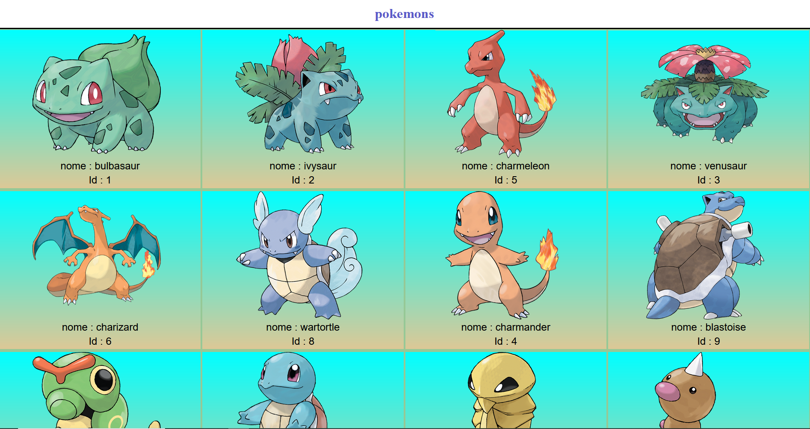
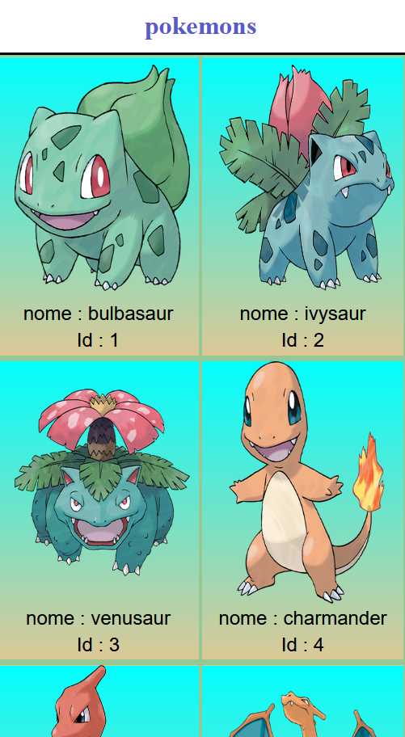

# pokemons
mostra imagens,nome e id de pokemons usando pokeApi

<a href="https://vilmar-moreira-souza.github.io/pokemons/" target="blank">visualizar</a>
<h2>desktop</h2>

<h2>mobile</h2>

 

<h3>sobre a aplicação</h3>

essa aplicação busca dados de pokemons da api pokeApi e mostra na tela,é possivel obeter varia informaçoes. nessa implementaçõa foi utilizada imagens com o nome e id   

 <a href="https://vilmar-moreira-souza.github.io/pokemons/" target="blank">visualizar </a>
 

<h3>ideias para implementar</h3>

 <li>melhorar o design</li>
<li> adicionar mais dados dos pokemons por exemplo habilidades</li>
<li> adicionar mais dados de outraas fontes</li>
<li> mais...</li>

<h3>bugs e problemas</h3>

<li>melhorar css- deixar codigo mais enxuto  </li>
<li>refatorar codigo javascript implementando funçoes para um codigo mais limpo   </li>
<li> mais...</li>